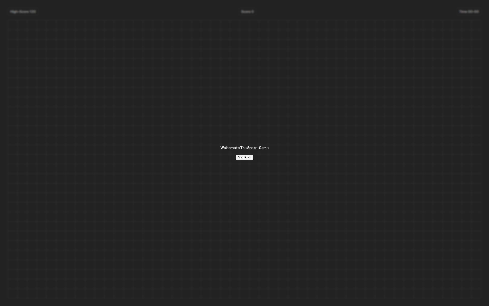
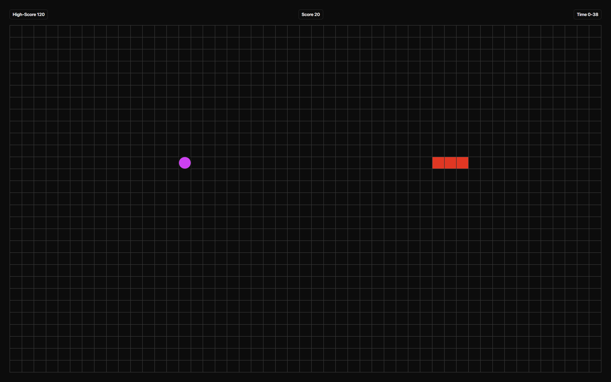
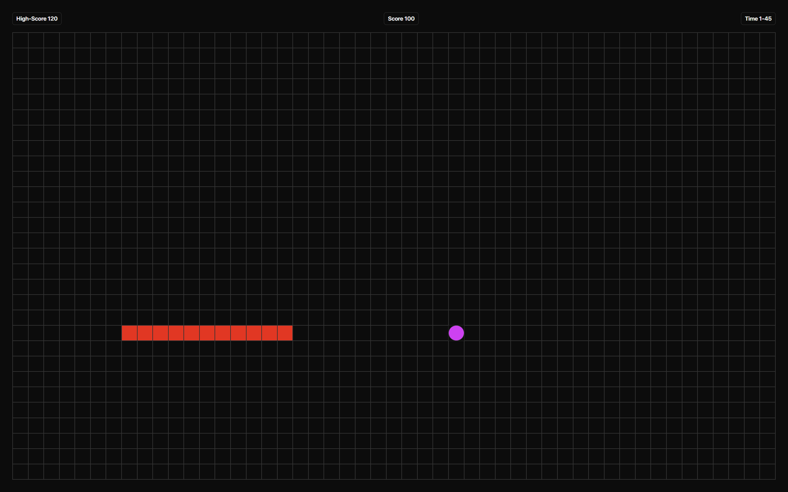
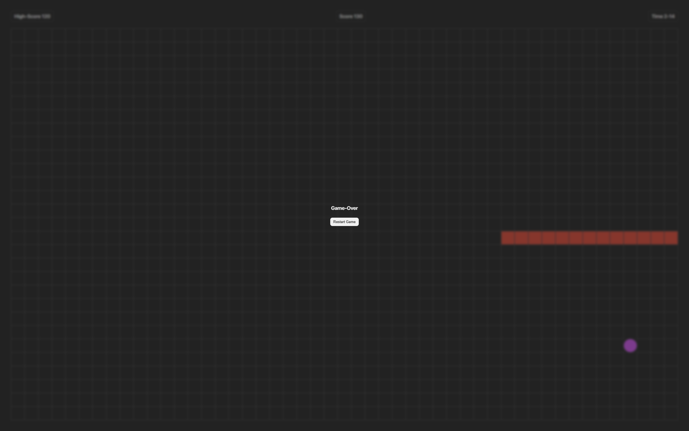

# 🐍 Snake Game

A modern Snake Game built with **Vanilla JavaScript**, **HTML5**, and **CSS3**. The project features real-time gameplay, score tracking, high-score persistence using LocalStorage, a timer system, and a responsive dark-themed interface.

---

## 🚀 Features

- 🎮 Smooth snake movement using keyboard controls
- 🍎 Random food generation
- 📈 Real-time score tracking
- 🏆 High score persistence with LocalStorage
- ⏱️ Game timer
- 💀 Collision detection and game-over system
- 🔄 Restart functionality
- 🌙 Clean dark-themed UI

---

## 🛠️ Technologies Used

- HTML5
- CSS3
- JavaScript (ES6)

---

## 📸 Screenshots

### Start Screen



### Gameplay



### Advanced Gameplay



### Game Over



---

## 🎯 Learning Outcomes

Through this project, I practiced and strengthened my understanding of:

- DOM Manipulation
- Event Handling
- Game Loop Logic
- Collision Detection
- State Management
- LocalStorage
- Arrays and Objects
- JavaScript Timing Functions (`setInterval`)
- Problem Solving & Debugging

---

## ▶️ Getting Started

### Clone the Repository

```bash
git clone https://github.com/PARTTTHH/Snake-Game.git 
```

### Run the Project

1. Open the project folder.
2. Open `index.html` in your browser.
3. Start playing.

---

## 📂 Project Structure

```text
Snake-Game/
│
├── index.html
├── style.css
├── script.js
├── README.md
│
└── screenshots/
    ├── start-screen.png
    ├── gameplay.png
    ├── gameplay2.png
    └── game-over.png
```

---

## 🔮 Future Improvements

- Multiple difficulty levels
- Pause / Resume functionality
- Sound effects
- Mobile touch controls
- Leaderboard system
- Animated UI enhancements

---

## 👨‍💻 Author

**PARTH PUNGAONKAR**

Built while strengthening my JavaScript fundamentals through hands-on project development.

---

⭐ If you like this project, consider giving it a star.
